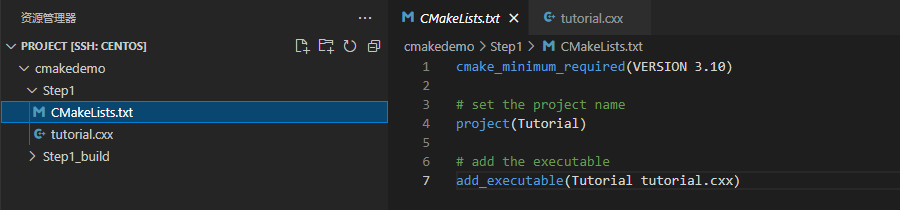
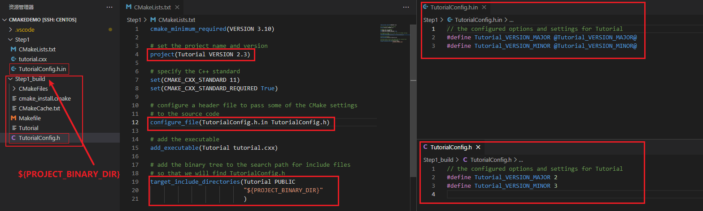
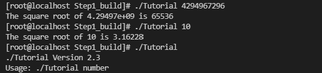
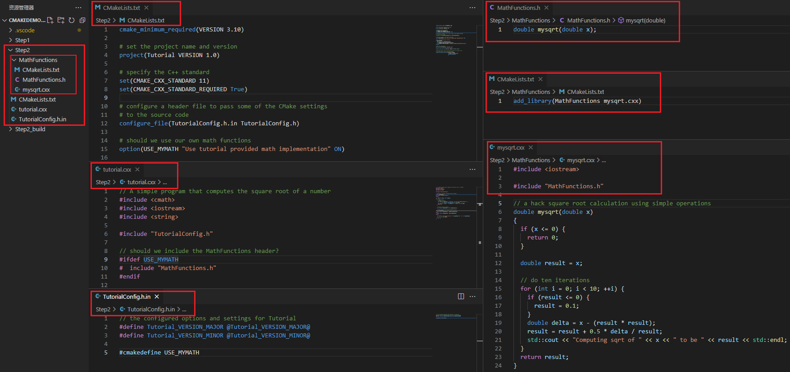
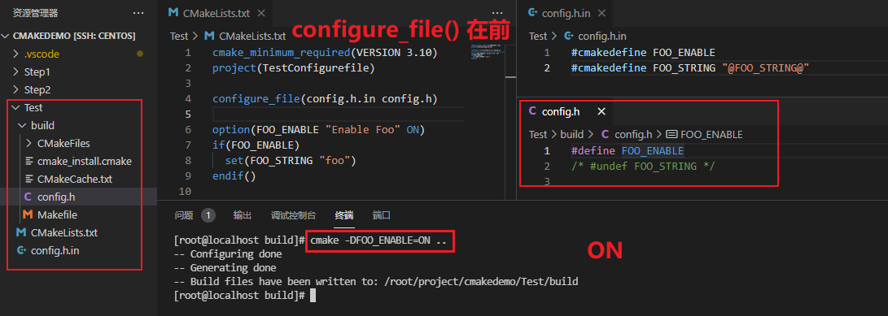
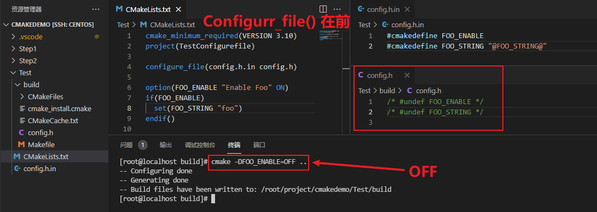
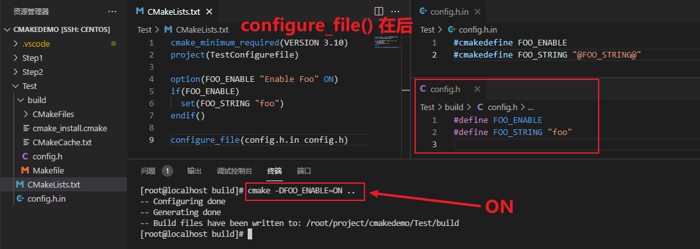
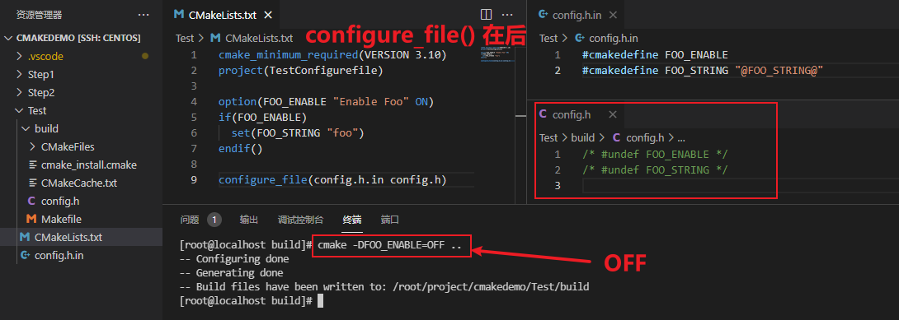
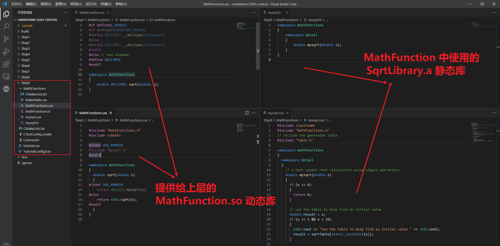

# CMake学习之路

我觉得一个工具最好的入门的文档必然是出自官方文档中  
这个系列主要就是对以下 **2** 个官方链接的文档进行的中文翻译, 语言也做了适当的调整

<https://github.com/Kitware/CMake/tree/master/Help/guide/tutorial>  
<https://cmake.org/cmake/help/latest/guide/tutorial/index.html>

- [CMake学习之路](#cmake学习之路)
  - [Step1 基本出发点](#step1-基本出发点)
    - [编译和运行](#编译和运行)
    - [添加版本号和配置头文件](#添加版本号和配置头文件)
    - [指定C++标准](#指定c标准)
    - [重新构建](#重新构建)
  - [Step2 使用库](#step2-使用库)
  - [Step3 对库添加使用要求](#step3-对库添加使用要求)
  - [Step4 安装和测试](#step4-安装和测试)
    - [安装规则](#安装规则)
    - [测试支持](#测试支持)
  - [Step5 添加系统自检](#step5-添加系统自检)
  - [Step6 添加自定义命令和生成的文件](#step6-添加自定义命令和生成的文件)
  - [Step7 打包安装程序](#step7-打包安装程序)
  - [Step8 添加对测试仪表板的支持](#step8-添加对测试仪表板的支持)
  - [Step9 选择静态或共享库](#step9-选择静态或共享库)
  - [Step10 添加生成器表达式](#step10-添加生成器表达式)
  - [Step11 添加导出配置](#step11-添加导出配置)
  - [Step12 打包调试和发布](#step12-打包调试和发布)

注意：文中给的示例，我均有验证，验证环境如下

- centos7
- gcc 4.8.5
- cmake 3.21.4

## Step1 基本出发点

最基本的项目是仅由源代码文件构建生成可执行文件。  
对于简单的项目，只需要一个三行的 `CMakeLists.txt` 文件。  
创建一个 `Step1` 文件夹，在 `Step1` 目录中创建一个 `CMakeLists.txt` 文件，如下所示:

```cmake
# CMakeLists.txt
cmake_minimum_required(VERSION 3.10)

# set the project name
project(Tutorial)

# add the executable
add_executable(Tutorial tutorial.cxx)
```

请注意，此示例在 `CMakeLists.txt` 文件中使用了小写命令。`CMake` 支持 **大写**、**小写** 和 **混合大小写** 命令。在 `Step1` 目录中创建一个 `tutorial.cxx` 的源代码文件，它可以用来计算一个数的平方根。`tutorial.cxx` 的源代码如下：

```cxx
// A simple program that computes the square root of a number
#include <cmath>
#include <cstdlib>
#include <iostream>
#include <string>

int main(int argc, char* argv[])
{
  if (argc < 2) {
    std::cout << "Usage: " << argv[0] << " number" << std::endl;
    return 1;
  }

  // convert input to double
  const double inputValue = atof(argv[1]);

  // calculate square root
  const double outputValue = sqrt(inputValue);
  std::cout << "The square root of " << inputValue << " is " << outputValue
            << std::endl;
  return 0;
}
```

### 编译和运行

对于一个 `demo` 而言，所有需要的文件就准备好了，我们现在可以构建和运行我们的项目了！首先，运行 `cmake` 可执行文件或者 `cmake-gui` 来配置项目，然后使用您选择的构建工具来构建它。(备注：`cmake-gui` 是 `windows` 下可视化工具，我的环境是`centos`，这部分就不验证了)

举个例子，调整我们的文件结构如图：



这里我们已经创建了构建目录 `Step1_build`

```shell
mkdir Step1_build
```

接下来，切换到 `Step1_build` 构建目录并运行 `CMake` 来配置项目并在本地生成构建系统:

```shell
cd Step1_build
cmake ../Step1
```

然后调用该构建系统来实际 编译/链接 项目：

```shell
cmake --build .
```

最后，编译产物 `Tutorial` 执行以下命令做一个简单的测试

```shell
./Tutorial 4294967296
./Tutorial 10
./Tutorial
```

### 添加版本号和配置头文件

我们要添加的第一个功能是为可执行文件和项目提供版本号。虽然我们可以在源代码中专门完成这项工作，但使用 `CMakeLists.txt` 提供了更大的灵活性。

首先，修改 `CMakeLists.txt` 文件，使用 `project()` 命令设置项目名称和版本号。

```cmake
cmake_minimum_required(VERSION 3.10)

# set the project name and version
project(Tutorial VERSION 2.3)
```

然后，配置一个头文件 `TutorialConfig.h.in` 放在 `CMakeLists.txt` 同级目录，将版本号传递给源代码：

```cmake
configure_file(TutorialConfig.h.in TutorialConfig.h)
```

由于配置的文件将写入到编译的目录里，因此我们必须将该目录添加到搜索头文件的路径列表中。将以下行添加到 `CMakeLists.txt` 文件的末尾：

```cmake
target_include_directories(Tutorial PUBLIC
                           "${PROJECT_BINARY_DIR}"
                           )
```

使用您喜欢的编辑器，在源目录中创建包含以下内容的 `TutorialConfig.h.in`：

```cxx
// the configured options and settings for Tutorial
#define Tutorial_VERSION_MAJOR @Tutorial_VERSION_MAJOR@
#define Tutorial_VERSION_MINOR @Tutorial_VERSION_MINOR@
```

当 `CMake` 配置此头文件时，`@Tutorial_VERSION_MAJOR@` 和 `@Tutorial_VERSION_MINOR@` 的值将被替换。

接下来，修改 `tutorial.cxx` 以包括配置的头文件 `TutorialConfig.h` 。

最后，让我们通过如下更新 `tutorial.cxx` 来打印出可执行文件的版本号：

```cxx
if (argc < 2) {
  // report version
  std::cout << argv[0] << " Version " << Tutorial_VERSION_MAJOR << "."
            << Tutorial_VERSION_MINOR << std::endl;
  std::cout << "Usage: " << argv[0] << " number" << std::endl;
  return 1;
}
```

新的目录结构如下：



注：

- `Step1_build` 就是 `${PROJECT_BINARY_DIR}` 构建目录
- `"configure_file(TutorialConfig.h.in TutorialConfig.h)"` 命令将 `TutorialConfig.h.in` 拷贝到构建目录中，并根据 `"project(Tutorial VERSION 2.3)"` 设置的版本号完成了 `Tutorial_VERSION_MAJOR` 和 `Tutorial_VERSION_MINOR` 的赋值

这里有个小细节，通过 `project()` 命令设置版本号的时候会给以下四个变量赋值

- `<PROJECT-NAME>_VERSION_MAJOR` ： 版本号第一位
- `<PROJECT-NAME>_VERSION_MINOR` ： 版本号第二位
- `<PROJECT-NAME>_VERSION_PATCH` ： 版本号第三位
- `<PROJECT-NAME>_VERSION_TWEAK` ： 版本号第四位

参数的详细说明可以从官方的说明文档中查看：  
<https://cmake.org/cmake/help/latest/variable/PROJECT-NAME_VERSION.html>

`configure_file()` 的引入实际上是为了将一些可配置性的信息，在 `CMakeLists.txt` 中定义或从系统中获取，然后生成头文件加入到项目中

### 指定C++标准

接下来，让我们将 `tutorial.cxx` 中的 `atof` 替换为 `std::stod`，从而向我们的项目添加一些 `C++11` 特性。
同时，删除 `#include<cstdlib>`

```cxx
const double inputValue = std::stod(argv[1]);
```

我们需要在 `CMake` 代码中显式声明它应该使用正确的标志。
在 `CMake` 中启用对特定 `C++` 标准支持的最简单方法是使用 `CMAKE_CXX_STANDARD` 变量。
对于本教程，请将 `CMakeLists.txt` 文件中的 `CMAKE_CXX_STANDARD` 变量设置为 `11`，将 `CMAKE_CXX_STANDARD_REQUIRED` 设置为 `True`。
确保将 `CMAKE_CXX_STANDARD` 声明添加到对 `ADD_EXECUTABLE` 的调用之上。

```cmake
cmake_minimum_required(VERSION 3.10)

# set the project name and version
project(Tutorial VERSION 1.0)

# specify the C++ standard
set(CMAKE_CXX_STANDARD 11)
set(CMAKE_CXX_STANDARD_REQUIRED True)
```

### 重新构建

我们已经创建了构建目录并运行了 `CMake`，因此可以跳到构建步骤：

```shell
cd Step1_build
cmake --build .
```

现在，我们可以尝试使用与前面相同的命令来使用运行

```shell
./Tutorial 4294967296
./Tutorial 10
./Tutorial
```

在不带任何参数的情况下运行可执行文件时，请检查现在是否打印了版本号。



## Step2 使用库

现在，我们将向项目中添加一个库。这个库将包含我们自己的用于计算数字平方根的实现。然后，可执行文件可以使用该库，而不是编译器提供的标准平方根函数。

在本教程中，我们将把库放到一个名为 `MathFunctions` 的子目录中。该目录已经包含头文件 `MathFunctions.h` 和源文件 `mysqrt.cxx` 。源文件有一个名为 `mysqrt` 的函数，它提供与编译器的 `sqrt` 函数类似的功能。

创建一个 `CMakeLists.txt` 文件添加到 `MathFunctions` 目录，并在文件写入：

```cmake
add_library(MathFunctions mysqrt.cxx)
```

`MathFunctions.h` 教程中写的特别简单

```cxx
double mysqrt(double x);
```

`mysqrt.cxx` 文件内容如下

```cxx
#include <iostream>

#include "MathFunctions.h"

// a hack square root calculation using simple operations
double mysqrt(double x)
{
  if (x <= 0) {
    return 0;
  }

  double result = x;

  // do ten iterations
  for (int i = 0; i < 10; ++i) {
    if (result <= 0) {
      result = 0.1;
    }
    double delta = x - (result * result);
    result = result + 0.5 * delta / result;
    std::cout << "Computing sqrt of " << x << " to be " << result << std::endl;
  }
  return result;
}
```

这样 `MathFunctions` 文件夹下由 **3** 个文件组成的子模块 `MathFunctions` 就全部准备就绪了

为了使用新的库，我们将在顶层 `CMakeLists.txt` 文件中添加一个 `add_subdirectory()` 调用，以便构建库。  
我们将新库添加到可执行文件中，并将 `MathFunctions` 添加到头文件查找路径中，以便可以找到 `MathFunctions` 的头文件。
顶层 `CMakeLists.txt` 文件的最后几行现在应该如下所示：

```cmake
# add the MathFunctions library
add_subdirectory(MathFunctions)

# add the executable
add_executable(Tutorial tutorial.cxx)

target_link_libraries(Tutorial PUBLIC MathFunctions)

# add the binary tree to the search path for include files
# so that we will find TutorialConfig.h
target_include_directories(Tutorial PUBLIC
                          "${PROJECT_BINARY_DIR}"
                          "${PROJECT_SOURCE_DIR}/MathFunctions"
                          )
```

现在，让我们将 `MathFunctions` 库设为 **可选**。  
虽然对于本教程来说，确实没有任何必要这样做，但是对于较大的项目来说，这是很常见的。  
第一步是向顶层 `CMakeLists.txt` 文件添加一个选项。

```cmake
option(USE_MYMATH "Use tutorial provided math implementation" ON)

# configure a header file to pass some of the CMake settings
# to the source code
configure_file(TutorialConfig.h.in TutorialConfig.h)
```

此选项将显示在 `cmake-gui` 和 `ccmake` 中，缺省值为 `ON`，可由用户更改。  
此设置将存储在缓存中，这样用户就不需要在每次对构建目录运行 `CMake` 时设置该值。
下一个更改是使构建和链接 `MathFunctions` 库成为条件。
为此，我们将创建一个 `if` 语句来检查选项的值。
在 `if` 块中，将上面的 `add_subdirectory()` 命令与一些附加的 `list` 命令放在一起，存储链接的库名称信息和库所在的子模块路径信息，配置进 `Tutorial` 中。  
现在，顶层 `CMakeLists.txt` 文件的结尾将如下所示：

```cmake
if(USE_MYMATH)
  add_subdirectory(MathFunctions)
  list(APPEND EXTRA_LIBS MathFunctions)
  list(APPEND EXTRA_INCLUDES "${PROJECT_SOURCE_DIR}/MathFunctions")
endif()

# add the executable
add_executable(Tutorial tutorial.cxx)

target_link_libraries(Tutorial PUBLIC ${EXTRA_LIBS})

# add the binary tree to the search path for include files
# so that we will find TutorialConfig.h
target_include_directories(Tutorial PUBLIC
                           "${PROJECT_BINARY_DIR}"
                           ${EXTRA_INCLUDES}
                           )
```

请注意，使用变量 `EXTRA_LIBS` 收集任何可选的库，以便稍后链接到可执行文件中。  
变量 `EXTRA_INCLUDE` 类似地用于可选头文件。  
这是处理许多可选组件时的经典方法，我们将在 `Step3` 中介绍现代方法。对源代码的相应更改相当简单。  
因为现在库的使用是可配置的形式，所以在 `tutorial.cxx` 源码中使用 `MathFunctions.h` 头文件也需要调整成可配置的形式：

```cxx
#ifdef USE_MYMATH
  #include "MathFunctions.h"
#endif
```

使用接口的地方也需要调整下面这样:

```cxx
#ifdef USE_MYMATH
  const double outputValue = mysqrt(inputValue);
#else
  const double outputValue = sqrt(inputValue);
#endif
```

由于源代码现在需要 `USE_MYMATH` ，我们可以用下面的代码行将其添加到 `TutorialConfig.h.in` 中：

```cxx
#cmakedefine USE_MYMATH
```

此时的代码结构如图：



运行 `cmake`可执行文件或 `cmake-gui` 来配置项目，然后使用您选择的构建工具构建它。

现在让我们更新 `USE_MYMATH` 的值。 `windows` 下最简单的方法是使用 `cmake-gui`，命令行的话通过以下命令来更改选项

```shell
# "ON" 是启用，"OFF" 是禁用
cmake ../Step2 -DUSE_MYMATH=OFF
```

重新生成并再次运行教程。

官方留了一个问题：为什么在 `USE_MYMATH` 选项之后配置 `TutorialConfig.h.in` 很重要？如果我们把这两个倒置一下，会发生什么呢？  

先说我的结论，`*.in` 这样的预配置文件中如果有从 `CMakeLists.txt` 中取变量值（`@VAR@`）的时候，这些变量的位置都应该在 `configure_file()` 这个函数前面完成定义和赋值

可以使用这样的一个例子测试：

`config.h.in` 文件如下

```cxx
#cmakedefine FOO_ENABLE
#cmakedefine FOO_STRING "@FOO_STRING@"
```

`CMakeLists.txt` 文件如下

```cmake
cmake_minimum_required(VERSION 3.10)
project(TestConfigurefile)

option(FOO_ENABLE "Enable Foo" ON)
if(FOO_ENABLE)
  set(FOO_STRING "foo")
endif()
configure_file(config.h.in config.h)
```

通过调整 `configure_file()` 函数位置，并执行以下的命令，检查生成的 `config.h` 的区别

```shell
mkdir build && cd build
cmake -DFOO_ENABLE=ON ..
cmake -DFOO_ENABLE=OFF ..
```









整理个列表更直观一点

| configure_file() 函数位置 | 状态 | 结果                                                    | 是否正常 |
| :------------------------ | :--- | :------------------------------------------------------ | :------- |
| 在前                      | ON   | #define FOO_ENABLE</br>/\* #undef FOO_STRING \*/        | 错误     |
| 在前                      | OFF  | /\* #undef FOO_ENABLE \*/</br>/\* #undef FOO_STRING \*/ | 正常     |
| 在后                      | ON   | #define FOO_ENABLE</br>#define FOO_STRING "foo"         | 正常     |
| 在后                      | OFF  | /\* #undef FOO_ENABLE \*/</br>/\* #undef FOO_STRING \*/ | 正常     |

`FOO_STRING` 值需要从 `CMakeLists.txt` 中获取，`configure_file()` 函数前置在变量前会导致 `FOO_STRING` 未赋值，从而出现异常  
所以建议 `configure_file()` 后置

## Step3 对库添加使用要求

`Cmake` 提供了命令允许对库或可执行文件的链接地址和头文件查找地址进行更好的控制，同时还允许对 `CMake` 内部目标的传递属性进行更多的控制。主要命令有:

- target_compile_definitions()
- target_compile_options()
- target_include_directories()
- target_link_libraries()

将 `Step2` 中添加库的经典方法，重构成使用以上命令来。我们首先声明，任何链接到 `MathFunctions` 的人都需要包含当前的源目录，而 `MathFunctions` 本身不需要。所以这可以成为一个接口性质的使用要求。

记住接口意味着消费者需要但生产者不需要的东西。将以下几行添加到 `MathFunctions/CMakeLists.txt` 的末尾:

```cmake
target_include_directories(MathFunctions
          INTERFACE ${CMAKE_CURRENT_SOURCE_DIR}
          )
```

现在我们已经指定了 `MathFunctions` 的使用要求，我们可以安全地从顶层 `CMakeLists.txt` 中删除 `EXTRA_INCLUDES` 变量的使用，如下所示:

```cmake
if(USE_MYMATH)
  add_subdirectory(MathFunctions)
  list(APPEND EXTRA_LIBS MathFunctions)
endif()
```

还有这里：

```cmake
target_include_directories(Tutorial PUBLIC
                           "${PROJECT_BINARY_DIR}"
                           )
```

完成后，运行 `cmake` 可执行文件或 `cmake-gui` 来配置项目，然后使用您选择的构建工具或使用 `cmake --build .` 在构建目录中来构建它。

这些接口具体的用法可以从

## Step4 安装和测试

现在，我们可以开始向我们的项目添加安装规则和测试支持。

### 安装规则

安装规则相当简单：对于 `MathFunction` ，我们希望安装库和头文件；对于应用程序，我们希望安装可执行文件和已配置的头文件。
因此，在 `MathFunctions/CMakeLists.txt` 的末尾，我们添加了：

```cmake
install(TARGETS MathFunctions DESTINATION lib)
install(FILES MathFunctions.h DESTINATION include)
```

在顶层 `CMakeLists.txt` 的末尾，我们添加：

```cmake
install(TARGETS Tutorial DESTINATION bin)
install(FILES "${PROJECT_BINARY_DIR}/TutorialConfig.h"
  DESTINATION include
  )
```

这就是创建教程的基本本地安装所需的全部内容。  
现在运行 `cmake` 可执行文件或 `cmake-gui` 来配置项目，然后使用您选择的构建工具构建它。  
然后从命令行使用 `cmake` 命令（在 `3.15` 中引入，旧版本的 `CMake` 必须使用 `make install`）的 `install` 选项运行安装步骤。
对于多配置工具，不要忘记使用 `--config` 参数来指定配置。如果使用 `IDE` ，只需构建安装目标。
此步骤将安装适当的头文件、库和可执行文件。例如：

```shell
cmake --install .
```

`CMake` 变量 `CMAKE_INSTALL_PREFIX` 用于确定将安装文件的根目录。如果使用 `cmake--install` 命令，可以通过 `--prefix` 参数覆盖安装前缀。例如：

```shell
cmake --install . --prefix "/home/myuser/installdir"
```

这里有个值得注意的地方 `CMAKE_INSTALL_PREFIX`

- `Unix` 系统的默认值为 `/usr/local`,
- `Windows` 的默认值为 `c:/Program Files/${PROJECT_NAME}`

所以这样的 `install(TARGETS MathFunctions DESTINATION lib)` 的命令，会被安装在 ``/usr/local/lib` 中

### 测试支持

接下来，让我们测试我们的应用程序。在顶层 `CMakeLists.txt` 文件的末尾，我们可以启用测试，然后添加一些基本测试来验证应用程序是否正常工作。

```cmake
enable_testing()

# does the application run
add_test(NAME Runs COMMAND Tutorial 25)

# does the usage message work?
add_test(NAME Usage COMMAND Tutorial)
set_tests_properties(Usage
  PROPERTIES PASS_REGULAR_EXPRESSION "Usage:.*number"
  )

# define a function to simplify adding tests
function(do_test target arg result)
  add_test(NAME Comp${arg} COMMAND ${target} ${arg})
  set_tests_properties(Comp${arg}
    PROPERTIES PASS_REGULAR_EXPRESSION ${result}
    )
endfunction()

# do a bunch of result based tests
do_test(Tutorial 4 "4 is 2")
do_test(Tutorial 9 "9 is 3")
do_test(Tutorial 5 "5 is 2.236")
do_test(Tutorial 7 "7 is 2.645")
do_test(Tutorial 25 "25 is 5")
do_test(Tutorial -25 "-25 is (-nan|nan|0)")
do_test(Tutorial 0.0001 "0.0001 is 0.01")
```

第一个测试简单地验证应用程序是否正在运行，没有段错误或其他崩溃，并且返回值为零。
这是 `CTest` 测试的基本形式。  
接下来一个测试使用 `PASS_Regular_Expression` 测试属性来验证测试的输出是否包含某些字符串。在这种情况下，验证在提供的参数数量不正确时是否打印用法消息。  
最后，我们有一个名为 `do_test` 的函数，它运行应用程序并验证针对给定输入计算的平方根是否正确。每次调用 `do_test` 时，都会根据传递的参数向项目添加一个新的测试，其中包含名称、输入和预期结果。  
重新构建应用程序，然后 `cd` 到二进制目录并运行 `ctest` 可执行文件：

```shell
ctest -N
ctest -VV
```

对于多配置生成器（例如 `Visual Studio`），必须使用 `-C <mode>` 标志指定配置类型。  
例如，要在 `Debug` 模式下运行测试，请使用二进制目录(而不是Debug子目录！)中的 `ctest -C Debug-VV`。  
`Release` 模式将从相同的位置执行，但使用的命令是 `-C Release`。或者，从 `IDE` 构建 `run_test` 目标。

add_test() 函数很简单就不展开了，主要解释一下 `set_tests_properties()` 函数

```c
set_tests_properties(test1 [test2...] PROPERTIES prop1 value1 prop2 value2)
```

设置测试条目的属性。如果未找到测试条目，`CMake` 将报告错误。`test1 [test2...]` 是 `add_test()` 函数中 `NAME` 后指定的名称，所有主要看一下 `PROPERTIES`，这里建议看一下官方的文档，很详细

<https://cmake.org/cmake/help/latest/manual/cmake-properties.7.html#test-properties>

## Step5 添加系统自检

让我们考虑在项目中添加一些代码，这些代码依赖于目标平台可能没有的特性。对于本例，我们将添加一些取决于目标平台是否具有 `log` 和 `exp` 函数的代码。  
当然，几乎每个平台都有这些功能，但本教程假设它们并不常见。

如果平台有 `log` 和 `exp`，那么我们将们在 `mysqrt` 函数中计算平方根中使用它们。  
我们首先使用 `MathFunctions/CMakeLists.txt` 中的 `CheckSymbolExists` 模块来测试这些函数的可用性。  
在某些平台上，我们需要链接到 `m` 库。如果最初没有找到 `log` 和 `exp`，则需要再次尝试。

```cmake
target_include_directories(MathFunctions
          INTERFACE ${CMAKE_CURRENT_SOURCE_DIR}
          )

# does this system provide the log and exp functions?
include(CheckSymbolExists)
check_symbol_exists(log "math.h" HAVE_LOG)
check_symbol_exists(exp "math.h" HAVE_EXP)
if(NOT (HAVE_LOG AND HAVE_EXP))
  unset(HAVE_LOG CACHE)
  unset(HAVE_EXP CACHE)
  set(CMAKE_REQUIRED_LIBRARIES "m")
  check_symbol_exists(log "math.h" HAVE_LOG)
  check_symbol_exists(exp "math.h" HAVE_EXP)
  if(HAVE_LOG AND HAVE_EXP)
    target_link_libraries(MathFunctions PRIVATE m)
  endif()
endif()
```

如果可用，使用 `target_compile_definitions()` 指定 `HAVE_LOG` 和 `HAVE_EXP` 作为私有编译定义。

```cmake
if(HAVE_LOG AND HAVE_EXP)
  target_compile_definitions(MathFunctions
                             PRIVATE "HAVE_LOG" "HAVE_EXP")
endif()
```

如果系统上有 `log` 和 `exp` ，那么我们将使用它们在 `mysqrt` 函数中计算平方根。将以下代码添加到 `MathFunctions/mysqrt` 中的 `mysqrt` 函数中。`CXX` (在返回结果之前不要忘记 `#endif` !):

```cxx
#if defined(HAVE_LOG) && defined(HAVE_EXP)
  double result = exp(log(x) * 0.5);
  std::cout << "Computing sqrt of " << x << " to be " << result
            << " using log and exp" << std::endl;
#else
  double result = x;
```

我们还需要修改mysqrt。CXX包含cmath。

```cxx
#include <cmath>
```

运行 `cmake` 可执行文件或 `cmake-gui` 来配置项目，然后使用您选择的构建工具构建它，并运行教程可执行文件。

## Step6 添加自定义命令和生成的文件

假设，出于本节的目的，我们决定不使用平台 `log` 和 `exp` 函数，而是希望生成一个包含预先计算的值的表，以便在 `mysqrt` 函数中使用。在本节中，我们将创建表作为构建过程的一部分，然后将该表编译到我们的应用程序中。  

首先，让我们删除 `MathFunctions/CMakeLists.txt` 中 `log` 和 `exp` 函数的检查。然后从 `mysqrt.cxx` 中删除 `HAVE_LOG` 和 `HAVE_EXP` 检查。同时，我们可以删除 `#include <cmath >`。  
在 `MathFunctions` 子目录中，一个名为 `MakeTable.cxx` 的新源文件来生成表。  

```cxx
// A simple program that builds a sqrt table
#include <cmath>
#include <fstream>
#include <iostream>

int main(int argc, char* argv[])
{
  // make sure we have enough arguments
  if (argc < 2) {
    return 1;
  }

  std::ofstream fout(argv[1], std::ios_base::out);
  const bool fileOpen = fout.is_open();
  if (fileOpen) {
    fout << "double sqrtTable[] = {" << std::endl;
    for (int i = 0; i < 10; ++i) {
      fout << sqrt(static_cast<double>(i)) << "," << std::endl;
    }
    // close the table with a zero
    fout << "0};" << std::endl;
    fout.close();
  }
  return fileOpen ? 0 : 1; // return 0 if wrote the file
}
```

查看文件后，我们可以看到表是作为有效的 `c++` 代码生成的，输出文件名作为参数传入。  
下一步是将适当的命令添加到 `MathFunctions/CMakeLists.txt` 文件中，以构建 `MakeTable` 可执行文件，然后将其作为构建过程的一部分运行。需要几个命令来完成这个任务。  
首先，在 `MathFunctions/CMakeLists.txt` 的顶部，添加 `MakeTable` 的可执行文件，就像添加任何其他可执行文件一样。

```cmake
add_executable(MakeTable MakeTable.cxx)
```

然后，我们添加一个自定义命令，指定如何通过运行 `MakeTable` 生成 `Table.h`。

```cmake
add_custom_command(
  OUTPUT ${CMAKE_CURRENT_BINARY_DIR}/Table.h
  COMMAND MakeTable ${CMAKE_CURRENT_BINARY_DIR}/Table.h
  DEPENDS MakeTable
  )
```

接下来，我们必须让 `CMake` 知道 `mysqrt`。`cxx` 依赖于生成的 `Table.h`。这是通过将生成的 `Table.h` 添加到库 `MathFunctions` 的源代码列表来实现的。

```cmake
add_library(MathFunctions
            mysqrt.cxx
            ${CMAKE_CURRENT_BINARY_DIR}/Table.h
            )
```

我们还必须将当前的构建目录添加到头文件查找的目录列表中，这样 `Table.h` 才能被 `mysqrt.cxx` 找到并包含。

```cmake
target_include_directories(MathFunctions
          INTERFACE ${CMAKE_CURRENT_SOURCE_DIR}
          PRIVATE ${CMAKE_CURRENT_BINARY_DIR}
          )
```

现在让我们使用生成的表。首先,修改 `mysqrt。cxx` 中包含 `Table.h`。接下来，我们可以重写 `mysqrt` 函数来使用这个表:

```cxx
double mysqrt(double x)
{
  if (x <= 0) {
    return 0;
  }

  // use the table to help find an initial value
  double result = x;
  if (x >= 1 && x < 10) {
    std::cout << "Use the table to help find an initial value " << std::endl;
    result = sqrtTable[static_cast<int>(x)];
  }

  // do ten iterations
  for (int i = 0; i < 10; ++i) {
    if (result <= 0) {
      result = 0.1;
    }
    double delta = x - (result * result);
    result = result + 0.5 * delta / result;
    std::cout << "Computing sqrt of " << x << " to be " << result << std::endl;
  }

  return result;
}
```

运行 `cmake` 可执行文件或 `cmake-gui` 来配置项目，然后用你选择的构建工具来构建它。

当这个项目被构建时，它将首先构建 `MakeTable` 可执行文件。然后它将运行 `MakeTable` 以生成 `Table.h`。最后，它将编译 `mysqrt` 。它包含了 `Table.h` 来生成 `MathFunctions` 库。

运行教程可执行文件，并验证它正在使用表。

## Step7 打包安装程序

接下来，假设我们希望将我们的项目分发给其他人，以便他们可以使用它。我们希望在各种平台上提供二进制和源代码发行版。这与我们之前在 `Step4 安装和测试` 中所做的安装有一点不同，在那里我们安装了我们从源代码中构建的二进制文件。在本例中，我们将构建支持二进制安装和包管理特性的安装包。为此，我们将使用 `CPack` 创建特定于平台的安装程序。具体来说，我们需要在顶层 `CMakeLists.txt` 文件的底部添加几行代码。

```cmake
include(InstallRequiredSystemLibraries)
set(CPACK_RESOURCE_FILE_LICENSE "${CMAKE_CURRENT_SOURCE_DIR}/License.txt")
set(CPACK_PACKAGE_VERSION_MAJOR "${Tutorial_VERSION_MAJOR}")
set(CPACK_PACKAGE_VERSION_MINOR "${Tutorial_VERSION_MINOR}")
set(CPACK_SOURCE_GENERATOR "TGZ")
include(CPack)
```

这就是所有的事情。我们首先包含 `InstallRequiredSystemLibraries`。此模块将包括项目当前平台所需的任何运行时库。接下来，我们将一些 `CPack` 变量设置为我们为这个项目存储许可证和版本信息的位置。版本信息在本教程的前面设置过，`license.txt` 已经包含在此步骤的顶级源目录中。变量: `CPACK_SOURCE_GENERATOR` 为源包选择文件格式。  
最后我们包括: `CPack` 模块，它将使用这些变量和当前系统的其他一些属性来设置一个安装程序。  
下一步是以通常的方式构建项目，然后运行 `cpack` 可执行文件。要构建二进制发行版，请从构建目录运行:

```shell
cpack
```

要指定生成规则，请使用 `-G` 选项。对于多配置构建，使用 `-C` 来指定配置。例如:

```shell
cpack -G ZIP -C Debug 
```

有关可用生成规则，请参见 `cpack-Generators(7)` 或调用 `cpack --help`。像 `ZIP` 会创建一个包含所有安装文件的压缩包。

要创建完整源代码树的归档，您需要键入：

```shell
cpack --config CPackSourceConfig.cmake
```

或者，运行 `Make Package` 或右键单击包目标并从 `IDE` 构建项目。

## Step8 添加对测试仪表板的支持

> 这里的仪表板我理解的就是可视化的测试结果展示，将测试结果上传到服务器端

添加对将测试结果提交到仪表板的支持非常简单。我们已经在测试支持中为我们的项目定义了许多测试。现在，我们只需运行这些测试并将其提交到仪表板。为了包括对仪表板的支持，我们在顶层 `CMakeLists.txt` 中包含了 `CTest` 模块。

```cmake
# enable_testing()

# enable dashboard scripting
include(CTest)
```

`CTest` 模块将自动调用 `enable_test()`，因此我们可以将其从 `CMake` 文件中删除。

我们还需要生成一个 `CTestConfig.cmake` 文件，该文件将放在顶层目录中，在该目录中我们可以向 `CTest` 指定有关项目的信息。它包括：

- 项目名称
- 向 `CDash` 服务器的提交生成文档的服务器URL地址

```cmake
set(CTEST_PROJECT_NAME "CMakeTutorial")
set(CTEST_NIGHTLY_START_TIME "00:00:00 EST")

set(CTEST_DROP_METHOD "http")
set(CTEST_DROP_SITE "my.cdash.org")
set(CTEST_DROP_LOCATION "/submit.php?project=CMakeTutorial")
set(CTEST_DROP_SITE_CDASH TRUE)
```

`Ctest` 可执行文件在运行时将读入此文件。要创建一个简单的仪表板，您可以运行 `cmake` 可执行文件或 `cmake-gui` 来配置项目，但先不要构建它。而是将目录切换都构建目录，然后运行：

```shell
ctest [-VV] -D Experimental
```

请记住，对于多配置生成器(例如Visual Studio)，必须指定配置类型：

```shell
ctest [-VV] -C Debug -D Experimental
```

或者，从 `IDE` 构建目标。

`Ctest` 可执行文件将构建并测试项目，并将结果提交到 `Kitware` 的公共仪表板：<https://my.cdash.org/index.php?project=CMakeTutorial>

## Step9 选择静态或共享库

在本节中，我们将介绍如何使用 `BUILD_SHARED_LIBS` 变量来控制：`add_Library` 的默认行为，并允许控制如何构建没有显式类型(静态、共享、模块或对象)的库。

为此，我们需要将 `BUILD_SHARED_LIBS` 添加到顶层 `CMakeLists.txt`。我们使用 `option()` 命令，因为它允许用户有选择地选择值应该是 `ON` 还是 `OFF`。

> `cmake` 变量 `BUILD_SHARED_LIBS` 是一个全局变量，主要是用于控制 `cmake` 是否可以生成动态 `so`  
> 默认情况下 `BUILD_SHARED_LIB` 变量打开状态为 `ON`，即默认使用 `add_library()` 缺省时创建库时，默认创建动态库。  
> 设置成 `OFF` 缺省的 `add_library()` 函数默认创建静态库

接下来，我们将重构 `MathFunctions`，使其成为使用 `mysqrt` 或 `sqrt` 封装的真正的库，而不需要调用代码来执行此逻辑。这也意味着 `USE_MYMATH` 不会控制 `MathFunctions` 的构建，而是会控制该库的行为。

第一步是更新顶层 `CMakeLists.txt` 的开始部分，使其如下所示：

```cmake
cmake_minimum_required(VERSION 3.10)

# set the project name and version
project(Tutorial VERSION 1.0)

# specify the C++ standard
set(CMAKE_CXX_STANDARD 11)
set(CMAKE_CXX_STANDARD_REQUIRED True)

# control where the static and shared libraries are built so that on windows
# we don't need to tinker with the path to run the executable
set(CMAKE_ARCHIVE_OUTPUT_DIRECTORY "${PROJECT_BINARY_DIR}")
set(CMAKE_LIBRARY_OUTPUT_DIRECTORY "${PROJECT_BINARY_DIR}")
set(CMAKE_RUNTIME_OUTPUT_DIRECTORY "${PROJECT_BINARY_DIR}")

option(BUILD_SHARED_LIBS "Build using shared libraries" ON)

# configure a header file to pass the version number only
configure_file(TutorialConfig.h.in TutorialConfig.h)

# add the MathFunctions library
add_subdirectory(MathFunctions)

# add the executable
add_executable(Tutorial tutorial.cxx)
target_link_libraries(Tutorial PUBLIC MathFunctions)
```

既然我们已经使 `MathFunction` 始终被使用，我们将需要更新库的逻辑。因此，在 `MathFunctions/CMakeLists.txt` 中，我们需要创建一个 `SqrtLibrary`，当启用 `USE_MYMATH` 时，将有条件地构建和安装该 `SqrtLibrary`。现在，由于这是一个教程，我们将明确要求静态构建 `SqrtLibrary`。  
最终结果是 `MathFunctions/CMakeLists.txt` 应该如下所示：

```cmake
# add the library that runs
add_library(MathFunctions MathFunctions.cxx)

# state that anybody linking to us needs to include the current source dir
# to find MathFunctions.h, while we don't.
target_include_directories(MathFunctions
                           INTERFACE ${CMAKE_CURRENT_SOURCE_DIR}
                           )

# should we use our own math functions
option(USE_MYMATH "Use tutorial provided math implementation" ON)
if(USE_MYMATH)

  target_compile_definitions(MathFunctions PRIVATE "USE_MYMATH")

  # first we add the executable that generates the table
  add_executable(MakeTable MakeTable.cxx)

  # add the command to generate the source code
  add_custom_command(
    OUTPUT ${CMAKE_CURRENT_BINARY_DIR}/Table.h
    COMMAND MakeTable ${CMAKE_CURRENT_BINARY_DIR}/Table.h
    DEPENDS MakeTable
    )

  # library that just does sqrt
  add_library(SqrtLibrary STATIC
              mysqrt.cxx
              ${CMAKE_CURRENT_BINARY_DIR}/Table.h
              )

  # state that we depend on our binary dir to find Table.h
  target_include_directories(SqrtLibrary PRIVATE
                             ${CMAKE_CURRENT_BINARY_DIR}
                             )

  target_link_libraries(MathFunctions PRIVATE SqrtLibrary)
endif()

# define the symbol stating we are using the declspec(dllexport) when
# building on windows
target_compile_definitions(MathFunctions PRIVATE "EXPORTING_MYMATH")

# install rules
set(installable_libs MathFunctions)
if(TARGET SqrtLibrary)
  list(APPEND installable_libs SqrtLibrary)
endif()
install(TARGETS ${installable_libs} DESTINATION lib)
install(FILES MathFunctions.h DESTINATION include)
```

接下来，更新 `MathFunctions/mysqrt.cxx` 以使用数学函数和详细名称空间：

```cxx
#include <iostream>
#include "MathFunctions.h"
// include the generated table
#include "Table.h"

namespace mathfunctions
{
  namespace detail
  {
    // a hack square root calculation using simple operations
    double mysqrt(double x)
    {
      if (x <= 0)
      {
        return 0;
      }

      // use the table to help find an initial value
      double result = x;
      if (x >= 1 && x < 10)
      {
        std::cout << "Use the table to help find an initial value " << std::endl;
        result = sqrtTable[static_cast<int>(x)];
      }

      // do ten iterations
      for (int i = 0; i < 10; ++i)
      {
        if (result <= 0)
        {
          result = 0.1;
        }
        double delta = x - (result * result);
        result = result + 0.5 * delta / result;
        std::cout << "Computing sqrt of " << x << " to be " << result << std::endl;
      }

      return result;
    }
  }
}
```

我们还需要对 `tutorial.cxx` 进行一些更改，以便它不再使用 `USE_MYMATH`：

- 始终包含 `MathFunctions.h`
- 始终使用 `mathfunctions::sqrt`
- 不包含 `cmath`

最后，更新 `MathFunctions/MathFunctions.h` 以使用 `DLL` 导出定义：

```cxx
#if defined(_WIN32)
#  if defined(EXPORTING_MYMATH)
#    define DECLSPEC __declspec(dllexport)
#  else
#    define DECLSPEC __declspec(dllimport)
#  endif
#else // non windows
#  define DECLSPEC
#endif

namespace mathfunctions {
double DECLSPEC sqrt(double x);
}
```

此时，如果您构建所有内容，您可能会注意到链接失败，因为我们将 **地址无关代码** 的静态库与具有 **地址有关代码** 的库组合在一起。解决此问题的方法是在 `SqrtLibrary` 中显式设置 `POSITION_INDEPENDENT_CODE`。

```cmake
# state that SqrtLibrary need PIC when the default is shared libraries
set_target_properties(SqrtLibrary PROPERTIES
                      POSITION_INDEPENDENT_CODE ${BUILD_SHARED_LIBS}
                      )

target_link_libraries(MathFunctions PRIVATE SqrtLibrary)
```

其中的命令 `set_target_properties(...)` 也等效于

```cmake
target_compile_options(SqrtLibrary PRIVATE "-fPIC")
```

这一块建议把完整项目拉下来看，教程中说明的不太完整



## Step10 添加生成器表达式

生成器表达式在构建系统生成期间进行计算，为每一个编译配置生成信息。

在许多目标属性（如 `LINK_LIBRARIES`、`INCLUDE_DIRECTORIES`、`COMPILE_DEFINITIONS`等）的上下文中允许使用生成器表达式。当使用命令填充这些属性（如 `target_link_libraries()`、`target_include_directories()`、`target_compile_definitions()` 等）时，也可以使用它们。

生成器表达式可用于启用条件链接、编译时使用的条件定义、条件包含目录等。这些条件可能基于生成配置、目标属性、平台信息或任何其他可查询的信息。  
有不同类型的生成器表达式，包括逻辑表达式、信息表达式和输出表达式。

逻辑表达式用于创建条件输出。基本表达式是 `0` 和 `1` 表达式。`$<0：...>` 将生成空字符串，而 `<1：...>` 则生成字符串 `...`。 它们也可以嵌套。

生成器表达式的常见用法是根据条件来添加编译器标志，例如用于语言级别或警告等。一个很好的模式是将此信息传递到 `INTERFACE` 目标中。让我们首先构造一个 `INTERFACE` 目标，并指定所需的 `C++` 标准级别 `11`，而不是使用 `CMAKE_CXX_STANDARD`。

```cmake
# specify the C++ standard
set(CMAKE_CXX_STANDARD 11)
set(CMAKE_CXX_STANDARD_REQUIRED True)
```

以上部分代码替换成

```cmake
add_library(tutorial_compiler_flags INTERFACE)
target_compile_features(tutorial_compiler_flags INTERFACE cxx_std_11)
```

注意：此后续部分将需要更改代码中的 `cmake_minimum_required()` 用法。即将使用的生成器表达式是在 `3.15` 中引入的。更新调用以要求更新的版本：

```cmake
cmake_minimum_required(VERSION 3.15)
```

接下来，我们为项目添加所需的编译器警告标志。由于警告标志因编译器而异，因此我们使用 `COMPILE_LANG_AND_ID` 生成器表达式来控制在给定语言和一组编译器 ID 的情况下应用哪些标志，如下所示：

```cmake
set(gcc_like_cxx "$<COMPILE_LANG_AND_ID:CXX,ARMClang,AppleClang,Clang,GNU,LCC>")
set(msvc_cxx "$<COMPILE_LANG_AND_ID:CXX,MSVC>")
target_compile_options(tutorial_compiler_flags INTERFACE
  "$<${gcc_like_cxx}:$<BUILD_INTERFACE:-Wall;-Wextra;-Wshadow;-Wformat=2;-Wunused>>"
  "$<${msvc_cxx}:$<BUILD_INTERFACE:-W3>>"
)
```

简单解释一下语法， `$<COMPILE_LANG_AND_ID:CXX,ARMClang,AppleClang,Clang,GNU,LCC>` 命令原型时

```cxx
$<COMPILE_LANG_AND_ID:language,compiler_ids>
```

当 `language` 的编译器是 `compiler_ids` 中任何一个条目匹配就是 `1`，否则是 `0`

而后面的关于 `GCC` 警告说明可以从以下网址中查看  
<https://gcc.gnu.org/onlinedocs/gcc/Option-Summary.html>

看看这个，我们看到警告标志被封装在一个 `BUILD_INTERFACE` 条件中。这样做是为了使我们已安装项目的使用者不会继承我们的警告标志。

`BUILD_INTERFACE` 说明可以从官网这个地址中查看  
<https://cmake.org/cmake/help/latest/manual/cmake-generator-expressions.7.html#genex:BUILD_INTERFACE>

修改 `MathFunctions/CMakeLists.txt` 实现所有的目标都会有一个 `target_link_libraries()` 来调用`tutorial_compiler_flags`。

```cmake
target_link_libraries(MakeTable PRIVATE tutorial_compiler_flags)

target_link_libraries(SqrtLibrary PUBLIC tutorial_compiler_flags)

target_link_libraries(MathFunctions PUBLIC tutorial_compiler_flags) 
```

## Step11 添加导出配置

在 `Step4 安装和测试` 中，我们通过 `CMake` 添加了安装项目库和头文件的功能。在 `Step7 打包安装程序`， 我们添加了打包此信息的功能，以便将其分发给其他人。  
下一步是添加必要的信息，以便其他 `CMake` 项目可以使用我们的项目，无论是从生成目录、本地安装还是在打包时。

第一步是更新我们的 `install（TARGETS）` 命令，不仅要指定 `DESTINATION`，还要指定 `EXPORT`。`EXPORT` 关键字生成一个 `CMake` 文件，其中包含用于从安装目录导入 `install` 命令中列出的所有目标的代码。因此，让我们继续通过更新 `MathFunctions/CMakeLists` 中的安装命令来显式`EXPOR` `MathFunctions` 库， `MathFunctions/CMakeLists.txt.txt`如下所示：

```cmake
set(installable_libs MathFunctions tutorial_compiler_flags)
if(TARGET SqrtLibrary)
  list(APPEND installable_libs SqrtLibrary)
endif()
install(TARGETS ${installable_libs}
        EXPORT MathFunctionsTargets
        DESTINATION lib)
install(FILES MathFunctions.h DESTINATION include)
```

现在，我们就有导出的 `MathFunctions`，我们也需要显示安装生成的 `MathFunctionsTargets.cmake` 文件。这是通过将下面的命令添加到顶层的 `CMakeLists.txt` 结尾：

```cmake
install(EXPORT MathFunctionsTargets
  FILE MathFunctionsTargets.cmake
  DESTINATION lib/cmake/MathFunctions
)
```

此时，你应该尝试运行 `CMake`。如果一切设置正确，您将看到 `CMake` 将生成一个错误，如下所示：

```shell
Target "MathFunctions" INTERFACE_INCLUDE_DIRECTORIES property contains
path:

  "/Users/robert/Documents/CMakeClass/Tutorial/Step11/MathFunctions"

which is prefixed in the source directory.
```

CMake想说的是，在生成导出信息期间，它将导出一个与当前计算机绑定的路径，但是在其他计算机上无效。解决这个问题的方法是更新 `MathFunctions` 的 `target_include_directories()`，以了解在构建目录和安装/包中使用时，它需要不同的 `INTERFACE` 位置。这意味着将 `MathFunctions` 的  `target_include_directories()` 调用转换为如下所示：

```cmake
target_include_directories(MathFunctions
                           INTERFACE
                            $<BUILD_INTERFACE:${CMAKE_CURRENT_SOURCE_DIR}>
                            $<INSTALL_INTERFACE:include>
                           )
```

更新后，我们可以重新运行 `CMake` 并验证它是否不再发出警告。

此时，我们已经让 `CMake` 正确地打包了所需的目标信息，但是我们仍然需要生成一个 `MathFunctionsConfig.cmake` ，以便 `CMake` 在使用 `find_package()` 命令可以找到我们的项目。因此，让我们继续向项目顶层添加一个名为 `Config.cmake.in` 的新文件，该文件包含以下内容：

```cmake

@PACKAGE_INIT@

include ( "${CMAKE_CURRENT_LIST_DIR}/MathFunctionsTargets.cmake" )
```

然后，要正确配置和安装该文件，请将以下内容添加到顶层 `CMakeLists.txt` 的底部：

```cmake
install(EXPORT MathFunctionsTargets
  FILE MathFunctionsTargets.cmake
  DESTINATION lib/cmake/MathFunctions
)

include(CMakePackageConfigHelpers)
```

接下来，我们执行 `configure_package_config_file()` 。此命令将配置所提供的文件，但与标准的 `configure_file()` 方式有一些特定的区别。要正确利用此功能，除了所需的内容之外，输入文件还应该有一行文本 `@PACKAGE_INIT@` 。该变量将被替换为将设置值转换为相对路径的代码块。这些新的值可以由相同的名称引用，但前缀是 `PACKAGE_PREFIX`。

```cmake
install(EXPORT MathFunctionsTargets
  FILE MathFunctionsTargets.cmake
  DESTINATION lib/cmake/MathFunctions
)

include(CMakePackageConfigHelpers)
# generate the config file that is includes the exports
configure_package_config_file(${CMAKE_CURRENT_SOURCE_DIR}/Config.cmake.in
  "${CMAKE_CURRENT_BINARY_DIR}/MathFunctionsConfig.cmake"
  INSTALL_DESTINATION "lib/cmake/example"
  NO_SET_AND_CHECK_MACRO
  NO_CHECK_REQUIRED_COMPONENTS_MACRO
  )
```

接下来是 `write_basic_package_version_file()`。此命令写入一个文件，供 “find_package” 文档使用，说明所需软件包的版本和兼容性。在这里，我们使用 `TUTURE_VERSION_*` 变量，并说明它与 `AnyNewerVersion` 兼容，这表示此版本或更高版本与请求的版本兼容。

```cmake
write_basic_package_version_file(
  "${CMAKE_CURRENT_BINARY_DIR}/MathFunctionsConfigVersion.cmake"
  VERSION "${Tutorial_VERSION_MAJOR}.${Tutorial_VERSION_MINOR}"
  COMPATIBILITY AnyNewerVersion
)
```

最后，设置要安装的两个生成的文件：

```cmake
install(FILES
  ${CMAKE_CURRENT_BINARY_DIR}/MathFunctionsConfig.cmake
  ${CMAKE_CURRENT_BINARY_DIR}/MathFunctionsConfigVersion.cmake
  DESTINATION lib/cmake/MathFunctions
  )
```

此时，我们已经为我们的项目生成了一个可重定位的 `CMake` 配置，该配置可以在项目安装或打包后使用。如果我们希望我们的项目也从构建目录中使用，我们只需将以下内容添加到顶层 `CMakeLists.txt` 的底部：

```cmake
export(EXPORT MathFunctionsTargets
  FILE "${CMAKE_CURRENT_BINARY_DIR}/MathFunctionsTargets.cmake"
)
```

通过这个导出调用，我们现在生成一个 `Targets.cmake`，允许 `build` 目录中配置的 `MathFunctionsConfig.cmake` 被其他项目使用，而不需要安装它。

## Step12 打包调试和发布

注意：此示例适用于单配置生成器，不适用于多配置生成器(例如 `Visual Studio`)。

默认情况下，`CMake` 的模型是构建目录只包含单个配置，可以是 `Debug`、`Release`、`MinSizeRel` 或 `RelWithDebInfo`。但是，可以将 `CPack` 设置为捆绑多个构建目录，并构建包含同一项目的多个配置的包。  

首先，我们想要确保 `debug` 和 `release` 构建不同名称的执行文件和库。让我们添加 `d` 作为 `debug` 版本的执行文件和库的后缀。

在顶层的 `CMakeLists.txt` 靠近开始的地方设置 `CMAKE_DEBUG_POSTFIX` ：

```cmake
set(CMAKE_DEBUG_POSTFIX d)

add_library(tutorial_compiler_flags INTERFACE)
```

在执行文件上添加 `DEBUG_POSTFIX` 属性：

```cmake
add_executable(Tutorial tutorial.cxx)
set_target_properties(Tutorial PROPERTIES DEBUG_POSTFIX ${CMAKE_DEBUG_POSTFIX})

target_link_libraries(Tutorial PUBLIC MathFunctions)
```

让我们还将版本编号添加到 `MathFunctions` 库中。在 `MathFunctions/CMakeLists.txt` 中，设置 `Version` 和 `SOVERSION` 属性：

```cmake
set_property(TARGET MathFunctions PROPERTY VERSION "1.0.0")
set_property(TARGET MathFunctions PROPERTY SOVERSION "1")
```

从Step12目录中，创建 `debug`和 `release`子目录。布局将如下所示：

```shell
- Step12
   - debug
   - release
```

现在我们需要设置、调试和发布构建。我们可以使用 `CMAKE_BUILD_TYPE` 设置配置类型：

```cmake
cd debug
cmake -DCMAKE_BUILD_TYPE=Debug ..
cmake --build .
cd ../release
cmake -DCMAKE_BUILD_TYPE=Release ..
cmake --build .
```

现在 `debug` 和 `release` 版本都已完成，我们可以使用自定义配置文件将这两个版本打包到单个版本中。在 `Step12` 目录中，创建一个名为 `MultiCPackConfig.cmake` 的文件。在该文件中，首先包括由 `cmake` 创建的默认配置文件。

接下来，使用 `CPACK_INSTALL_CMAKE_PROJECTS` 变量来指定安装哪个工程。在我们的例子中，我们想要同时安装 `debug` 和 `release` 版本。

```cmake
include("release/CPackConfig.cmake")

set(CPACK_INSTALL_CMAKE_PROJECTS
    "debug;Tutorial;ALL;/"
    "release;Tutorial;ALL;"
)
```

在 `Step12` 目录中，运行 `cpack` 指定我们的自定义配置文件。

```shell
cpack --config MultiCPackConfig.cmake
```
